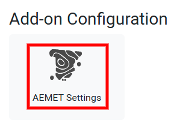
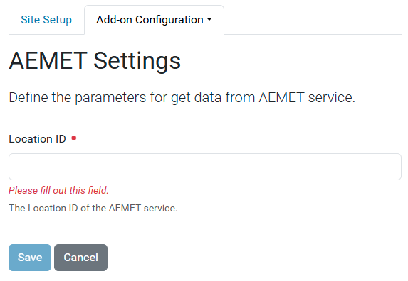

---
myst:
  html_meta:
    "description": "AEMET integration with Plone how-to guides"
    "property=og:description": "AEMET Plone how-to guides"
    "property=og:title": "AEMET integration with Plone how-to guides"
    "keywords": "Plone, AEMET integration with Plone, how-to, guides"
---

# How-to guides

This part of the documentation contains how-to guides, including installation and usage.

## Features

- Control panel in Plone registry to manage ``AEMET`` settings.
- RestApi endpoint that exposes these settings for Volto.

## Volto integration

To use this product in Volto, your Volto project needs to include a new add-on: https://github.com/macagua/volto-aemet

## Translations

This product has been translated into

- English
- Spanish

## Compatibility

- Tested with Python 3.12 and Plone 6.1.5.

## Install it

Install `collective.volto.aemet` with `pip`:

```shell
pip install collective.volto.aemet
```

## Enable it

Go to the `Site setup`, next to the `Add-ons` control panel, find the `collective.volto.aemet` add-on and click on the `Install` button. 

## Use it

To use this add-on, go to the `Site setup`, next to the ``Add-on Configuration`` icon, as shown below:



This `AEMET Settings`, you can access the control panel, as shown below:



In this control panel, you can configure the following fields:

- ``Site Key`` **(public key)**.

- ``Site Secret`` **(private key)**.

## Security access

The  `collective.volto.aemet` add-on includes the following roles and permissions:

### Roles

- ``AEMET`` role (**NEW!!!**).

### Permissions

- ``volto.aemet: Manage AEMET Settings`` permission (**NEW!!!**) grants access to the following roles:

  - ``AEMET`` role.

- The ``Plone Site Setup: Overview`` permission grants access to the `Site Setup: Overview ` view to the following roles:

  - The ``Manager`` role.

  - The ``Site Administrator`` role.

  - The ``AEMET`` role.
