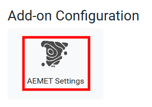
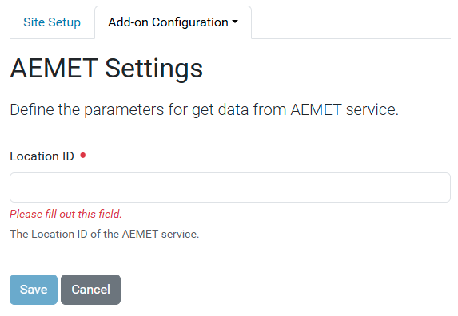

---
myst:
  html_meta:
    "description": "AEMET integration with Plone how-to guides"
    "property=og:description": "AEMET Plone how-to guides"
    "property=og:title": "AEMET integration with Plone how-to guides"
    "keywords": "AEMET, service, Plone, integration, documentation, how-to, guides"
---

# General information

This part of the documentation contains how-to guides, and including installation and usage.

## Features

- Control panel in {term}`Plone` registry to manage {term}`AEMET Settings`.

- RestApi endpoint that exposes the {term}`AEMET Settings` for {term}`Volto` _integration_.

- RestApi endpoint that exposes the current _weather forecast_ for the {term}`Location ID` defined on the {term}`AEMET Settings` control panel.

## Volto integration

To use this product in {term}`Volto`, you needs to include the following {term}`add-on`
in your project: {term}`volto-aemet`.

## Translations

This product support the following languages:

- Basque

- Catalan

- English

- Galician

- Spanish

## Compatibility

- Tested with `Python` 3.12 and {term}`Plone` 6.1.5.

## Install it

To install in your project, the {term}`collective.volto.aemet` {term}`add-on` with `pip` command:

```shell
pip install collective.volto.aemet
```

## Enable it

Visit http://localhost:8080/Plone in a browser, login, so go to `Site setup`, next to `Add-ons` control panel, 
find the {term}`collective.volto.aemet` {term}`add-on` and select the `Install` button for enabled it.

## Settings it

This integration uses the {term}`AEMET` service called '[Predicción por municipios](https://www.aemet.es/es/eltiempo/prediccion/municipios)'
on its website. For example, for the every municipality:

- '[Sevilla (Sevilla)](https://www.aemet.es/es/eltiempo/prediccion/municipios/sevilla-id41091)', it provides detailed information
   on the weather forecast for this municipality. It also exports information in `XML` format:

   - https://www.aemet.es/xml/municipios/localidad_41091.xml

     ```{note}
     The `XML` file name has a prefix called `localidad_` and a suffix with an **ID**. For example,
     the ID for the municipality of _Seville_ is `41091`. This **ID** will be used later in the
     `AEMET Settings` control panel.
     ```

To use this {term}`add-on`, go to the `Site setup`, next to the ``Add-on Configuration`` icon, as shown below:



This {term}`AEMET Settings`, you can access the control panel, as shown below:



In this control panel, you can configure the following fields:

- {term}`Location ID`, The Location ID of the {term}`AEMET` service, for example '41091' to Sevilla location ID.

## Use it

To use the {term}`AEMET` integration you need add the {term}`volto-aemet` {term}`add-on`, in
your {term}`Volto` project and use the amazing features into this {term}`add-on`.
